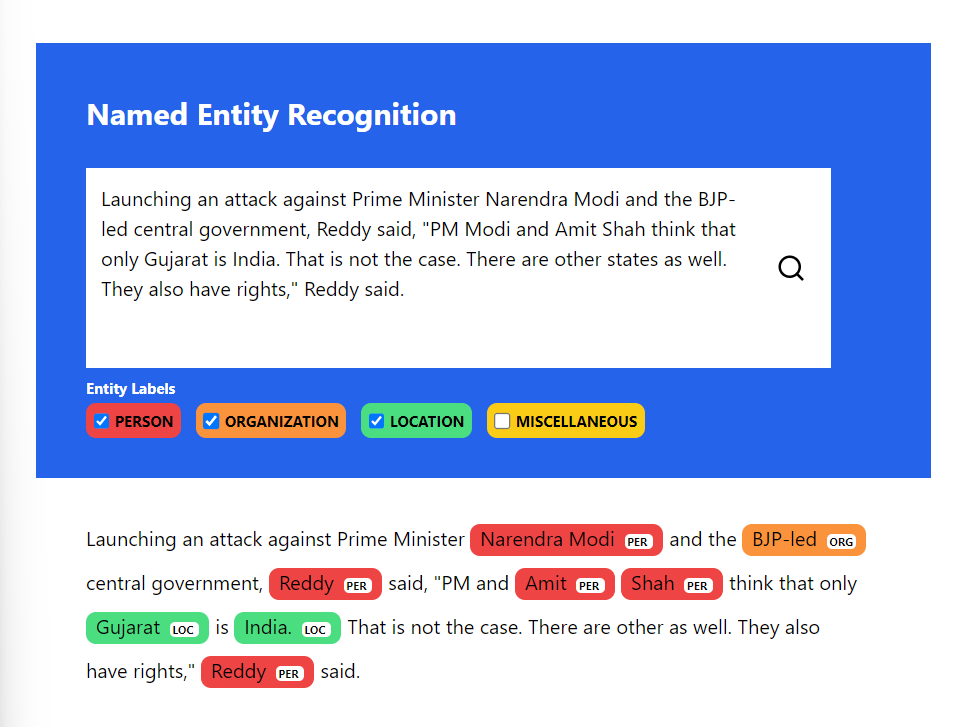

# Named-Entity-Recognition-News

## Overview

**Named-entity recognition** is a subtask of information extraction that seeks to locate and classify named entities mentioned in unstructured text into pre-defined categories such as person names, organizations, locations, medical codes, time expressions, quantities, monetary values, percentages, etc.

I utilized **Tranformer Encoder** architecture and **Glove pretrained embeddings** for token embeddings. The whole model is built using **Tensorflow 2** and used **DVC** and **mlflow** for data versioning and experimenting the model. React JS is used to present inference results.

Some challenges I faced included **overfitting of token embeddings during training** which did not bring a decent semantic representation which resulted in model being less generalized to the real world data. To address this, I replaced the weights with **Glove 100d pre-trained embeddings** and froze them.

### Screenshot



## Prerequisites

Ensure you have the following software installed:

- Python 3.11 or higher
- node.js and npm

## Installation

### Backend

1.  **Create a Virtual Environment:**
    ```bash
    python -m venv venv
    ```
2.  **Activate the Virtual Environment:**
    - On Windows:
      ```bash
      venv\Scripts\activate
      ```
    - On macOS/Linux:
      ```bash
      source venv/bin/activate
      ```
3.  **Install Dependencies:**
    ```bash
    pip install -r requirements.txt
    ```
4.  **Run the Application:**
    ```bash
    python app.py
    ```
5.  **Access the API endpoint for prediction:**
    fetch `http://127.0.0.1:5000/predict`.

### Frontend

1.  **Enter frontend directory**
    ```bash
    cd fontend
    ```
2.  **Install Dependencies:**
    ```bash
    npm install
    ```
3.  **Run the Application:**
    ```bash
    npm start
    ```
4.  **Access the Website:**
    Navigate to `http://127.0.0.1:3000/` on your browser.

## Results

|                          |      |
| ------------------------ | ---- |
| accuracy                 | 0.94 |
| precision(macro-average) | 0.77 |
| recall(macro-average)    | 0.69 |
| f1-score(macro-average)  | 0.72 |

## Data Source

**Dataset**

- [conll2003](https://huggingface.co/datasets/conll2003)

**Embeddings**

- [GloVe 6B](https://downloads.cs.stanford.edu/nlp/data/glove.6B.zip)
